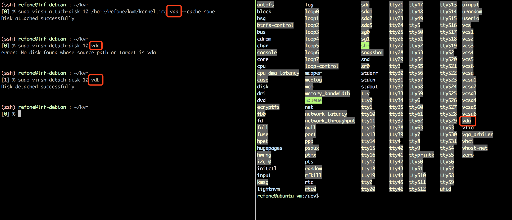

> [Creating Virtual Machines in KVM: Part 1](https://www.linux.com/learn/intro-to-linux/2017/5/creating-virtual-machines-kvm-part-1)

> [ubuntu kvm](https://help.ubuntu.com/community/KVM/Installation)

> [KVM 命令行启动第一台虚拟机](https://www.cnblogs.com/yexiaochong/p/6029315.html)

# KVM preparation
## neccesary libs:
```
sudo apt-get install qemu-kvm libvirt-bin virt-manager bridge-utils
```
查看当前运行虚拟机，可以用以检测kvm是否成功运行
```
sudo virsh list --all
```

# Creating VM image

## 创建30G的qcow2镜像
```
qemu-img create -f qcow2 ubuntu16.qcow2 30G
```
```powershell
(ssh) refone@lrf-debian : ~/kvm
% qemu-img create -f qcow2 ubuntu16.qcow2 30G
Formatting 'ubuntu16.qcow2', fmt=qcow2 size=32212254720 encryption=off cluster_size=65536 lazy_refcounts=off
```
## 查看创建镜像
```
qemu-img info ubuntu16.qcow2
```
```powershell
(ssh) refone@lrf-debian : ~/kvm
% qemu-img info ubuntu16.qcow2
image: ubuntu16.qcow2
file format: qcow2
virtual size: 30G (32212254720 bytes)
disk size: 196K
cluster_size: 65536
Format specific information:
    compat: 1.1
    lazy refcounts: false
```
## 启动安装镜像
```powershell
virt-install --name ubuntu16.04 --virt-type kvm --ram 1024 --cdrom=ubuntu-16.04-desktop.iso --disk ubuntu16.qcow2 --graphics vnc,listen=0.0.0.0 --noautoconsole
```
```powershell
(ssh) refone@lrf-debian : ~/kvm
% virt-install --name ubuntu16.04 --virt-type kvm --ram 1024 --cdrom=ubuntu-16.04-desktop.iso --disk ubuntu16.qcow2 --graphics vnc,listen=0.0.0.0 --noautoconsole

Starting install...
Creating domain...                                                                                                                                            |    0 B     00:00
Domain installation still in progress. You can reconnect to
the console to complete the installation process.
```

这时候用vncviewer连进去```[本机IP]:0```，开始安装，安装完成后点击重启，因为使用的是```virt-install```命令，系统并不会重启，不过在```virsh list```中就会出现刚刚安装好的虚拟机，再次```sudo virsh start [虚拟机name]```即可启动。

## 启动已有镜像
没亲自尝试，在```virt-install```命令中去掉```--cdrom```那一项，直接从```--disk```里面起。

# Manage VM
## 查看虚拟机列表
```
sudo virsh list --all
```
```
(ssh) refone@lrf-debian : ~/kvm
[0] % sudo virsh list --all
 Id    Name                           State
----------------------------------------------------
 -     ubuntu16                       shut off
```
在列表上删除虚拟机
```powershell
sudo virsh undefine ubuntu16
```

## 启动/关闭虚拟机
```
sudo virsh start ubuntu16
```
```powershell
sudo virsh destroy ubuntu16 #或domID
```

## 查看/修改Guest配置

* 导出guest的XML文件
```powershell
sudo virsh dumpxml ubuntu16 > ubuntu16.xml
```
* 编辑XML文件，具体可参考[Domain XML format](https://libvirt.org/formatdomain.html#elementsDevices)

* 重新定义guest配置
```
sudo virsh define ubuntu16.xml
```
Tips: 当出现uuid被占用情况的时候可以使用```uuidgen```命令创建一个新的uuid
```powershell
(ssh) refone@lrf-debian : ~/kvm
[0] % uuidgen
b7a63-f8c6-49e3-b0ad-7199ef4fadf5
```

或者用```virsh edit```直接进行更新
```
sudo virsh edit [domID]
```

## Concole到VM
* 查看guest串口
```powershell
sudo virsh ttyconsole 10 #10是我Guest的ID号
```
```powershell
(ssh) refone@lrf-debian : ~/kvm
[0] % sudo virsh ttyconsole 10
/dev/pts/3
```
* 用```virsh edit```修改guset配置
```xml
    <console type='pty'>
[+]     <source path='/dev/pts/3'/>
        <target port='0'/>
    </console>
```
* 在guest中(Ubuntu15.04及以后)翘入如下命令:
```powershell
sudo systemctl enable serial-getty@ttyS0.service
sudo systemctl start serial-getty@ttyS0.service
```
* console到VM
```
sudo virsh console 10
```

## 挂载新硬盘
挂载硬盘
```powershell
sudo virsh attach-disk 10 /home/refone/kvm/kernel.img vda --cache none  # 10 is domID
```
卸载硬盘
```powershell
sudo virsh detach-disk 10 vda
```
这里可能有个bug，挂载时指定的vda没什么用，在guest里面都是从/dev/vda,/dev/vdb...这样开始排的，但扯淡的是在卸载的时候，卸载名不是guset里面显示的名字，而是一开始翘进去的名字。



